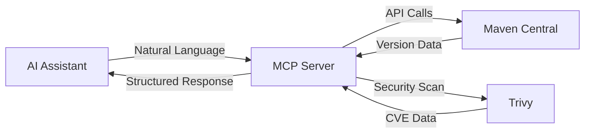

# Maven MCP Server

[](https://github.com/danielscholl/mvn-mcp-server/actions/workflows/ci.yml)
[](https://github.com/danielscholl/mvn-mcp-server/releases)
[](https://www.python.org/downloads/)
[](https://opensource.org/licenses/MIT)
[](https://modelcontextprotocol.io)

**AI-powered Maven dependency management through natural language.**

Maven MCP Server enables AI assistants to interact with Maven Central repository, providing comprehensive tools for version checking, security scanning, and dependency analysis—all through conversational interfaces.

## Features

✨ **Version Management**
- Check single or batch dependency versions
- Discover available updates (major/minor/patch)
- List version history grouped by tracks

🔒 **Security Scanning**
- Integrate Trivy vulnerability scanning
- CVE detection with severity filtering
- Multi-module project support

📊 **Enterprise Workflows**
- Guided dependency triage analysis
- Actionable remediation planning
- Complete audit trail with CVE traceability

🚀 **AI-Optimized**
- Single-call comprehensive responses
- Batch operations for efficiency
- Intelligent caching (80%+ hit rate)

## Quick Start

### Installation

```bash
# Install from PyPI
pip install mvn-mcp-server

# Or using uv (recommended)
uv pip install mvn-mcp-server
```

### Configuration

Add to your MCP settings (`.mcp.json` or Claude Desktop config):

```json
{
  "mcpServers": {
    "mvn-mcp-server": {
      "command": "uvx",
      "args": ["mvn-mcp-server"]
    }
  }
}
```

**That's it!** The server is now available to your AI assistant.

### First Query

Try asking your AI assistant:

> "Check if Spring Core 5.3.0 has any updates available"

Or:

> "Scan my Java project for security vulnerabilities"

## What You Can Do

### Check Dependencies

```
Check org.springframework:spring-core version 5.3.0
```

Returns: Existence, latest versions (major/minor/patch), update recommendations

### Batch Operations

```
Check these dependencies for updates:
- org.springframework:spring-core 5.3.0
- junit:junit 4.13.2
- com.fasterxml.jackson.core:jackson-databind 2.13.0
```

Returns: Summary statistics and individual results—all in one response

### Security Scanning

```
Scan this Java project for vulnerabilities
```

Returns: CVE findings, severity breakdown, affected dependencies, fix recommendations

### Enterprise Workflows

**Complete dependency management:**

1. **Triage**: `Run dependency triage for my-service`
   - Scans workspace
   - Checks for updates
   - Identifies vulnerabilities
   - Generates report

2. **Plan**: `Create update plan for my-service`
   - Prioritizes by severity
   - Creates implementation phases
   - Links tasks to CVEs
   - Provides file locations

3. **Implement**: Follow the plan using individual tools

## Available Tools

| Tool | Description |
|------|-------------|
| **check_version_tool** | Check single dependency version |
| **check_version_batch_tool** | Check multiple dependencies |
| **list_available_versions_tool** | List version history by tracks |
| **scan_java_project_tool** | Security scan with Trivy |
| **analyze_pom_file_tool** | Analyze POM file |

## Available Prompts

| Prompt | Description |
|--------|-------------|
| **triage** | Complete dependency and vulnerability analysis |
| **plan** | Generate actionable remediation plan |
| **list_mcp_assets** | Show all capabilities with examples |

## Documentation

### For Users

- **[Usage Guide](USAGE.md)** - Detailed examples and workflows
- **[Project Brief](docs/project-brief.md)** - Design philosophy and goals

### For Developers

- **[Contributing](CONTRIBUTING.md)** - How to contribute
- **[Architecture](docs/project-architect.md)** - Technical deep-dive
- **[ADR Catalog](docs/adr/index.md)** - Design decisions
- **[Publishing](docs/PUBLISHING.md)** - Release process

### Additional Resources

- **[AI Evolution](AI_EVOLUTION.md)** - Project development story
- **[Product Requirements](docs/project-prd.md)** - Feature specifications

## Requirements

- **Python**: 3.12 or 3.13
- **Optional**: Trivy (for security scanning)
  ```bash
  brew install trivy  # macOS
  ```

## Advanced Installation

<details>
<summary>Install from GitHub (latest unreleased)</summary>

```json
{
  "mcpServers": {
    "mvn-mcp-server": {
      "command": "uvx",
      "args": [
        "--from",
        "git+https://github.com/danielscholl/mvn-mcp-server@main",
        "mvn-mcp-server"
      ]
    }
  }
}
```

</details>

<details>
<summary>Development Setup</summary>

```bash
# Clone repository
git clone https://github.com/danielscholl/mvn-mcp-server.git
cd mvn-mcp-server

# Install dependencies
uv sync

# Install in development mode
uv pip install -e '.[dev]'

# Run tests
uv run pytest
```

See [CONTRIBUTING.md](CONTRIBUTING.md) for detailed development guide.

</details>

## Example Queries

**Version Checking:**
- "Is Spring Boot 3.2.0 the latest version?"
- "What's the latest patch version of Log4j 2.17?"
- "Show me all versions of Commons Lang3"

**Security:**
- "Scan my project for critical vulnerabilities"
- "Analyze this pom.xml for security issues"
- "What CVEs affect my dependencies?"

**Dependency Management:**
- "Run a complete triage of my-service"
- "Create an update plan focusing on high-severity issues"
- "What dependencies are outdated in my project?"

## How It Works



The server:
1. Translates natural language to Maven API calls
2. Queries Maven Central for version/dependency data
3. Optionally scans with Trivy for vulnerabilities
4. Returns comprehensive, AI-optimized responses
5. Caches results for 80%+ efficiency

## Performance

- **Response Time**: <2s for single dependency checks
- **Cache Hit Rate**: >80% for common dependencies
- **Batch Efficiency**: Linear scaling up to 1000 dependencies
- **Coverage**: 82% test coverage

## Contributing

We welcome contributions! See [CONTRIBUTING.md](CONTRIBUTING.md) for:
- Development setup
- Testing guidelines
- Code style requirements
- Pull request process

## Support

- **Issues**: [GitHub Issues](https://github.com/danielscholl/mvn-mcp-server/issues)
- **Discussions**: [GitHub Discussions](https://github.com/danielscholl/mvn-mcp-server/discussions)
- **Security**: See [SECURITY.md](SECURITY.md)

## License

This project is licensed under the MIT License - see [LICENSE](LICENSE) for details.

---

## About

This project demonstrates AI-first Maven integration through the Model Context Protocol, enabling natural language dependency management powered by FastMCP and optimized for production use.

**Built with**: Python 3.12+ | FastMCP | Pydantic | httpx

**Developed using**: AI-assisted workflows with Claude Code and GitHub Copilot

---

<div align="center">

**[Get Started](#quick-start)** • **[Documentation](#documentation)** • **[Contributing](CONTRIBUTING.md)**

</div>
