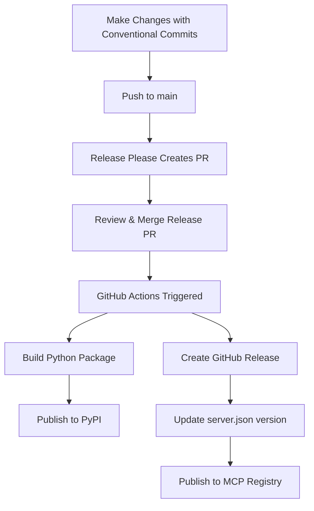

# Publishing Guide

This document explains how to publish the Maven MCP Server through multiple distribution channels.

## Understanding the Distribution Strategy

The Maven MCP Server is a **Python-based** MCP server (not a Maven/Java application) that provides Maven Central repository integration. Therefore, we publish through two complementary channels:

1. **PyPI** (Python Package Index) - For Python ecosystem distribution
2. **MCP Registry** - For MCP-specific discovery and installation

## Channel 1: PyPI Publishing (Primary)

### Overview

PyPI publishing allows users to install via standard Python tools:
```bash
pip install mvn-mcp-server
# or
uvx mvn-mcp-server
```

### Prerequisites

1. **Enable GitHub Actions Permissions**
   - Go to: `https://github.com/danielscholl/mvn-mcp-server/settings/actions`
   - Under "Workflow permissions":
     - ✅ Check "Allow GitHub Actions to create and approve pull requests"
     - Click Save

2. **Configure PyPI Trusted Publishing** (Optional but Recommended)
   - Go to [PyPI](https://pypi.org/) and log in
   - Navigate to Account Settings → Publishing
   - Add publisher with repository details

### Publishing Process

The repository uses **Release Please** for automated releases:

1. **Make Changes with Conventional Commits**
   ```bash
   git commit -m "feat: add new feature"
   git commit -m "fix: resolve bug"
   ```

2. **Release Please Creates PR**
   - Automatically creates a release PR when commits are pushed to main
   - Updates CHANGELOG.md
   - Bumps version in pyproject.toml

3. **Merge Release PR**
   - Review and merge the release PR
   - GitHub Actions automatically:
     - Creates GitHub release
     - Builds Python package
     - Publishes to PyPI

### Manual PyPI Publishing (Alternative)

If you need to publish manually:

```bash
# Build the package
uv pip install build
python -m build

# Upload to PyPI (requires API token)
uv pip install twine
twine upload dist/*
```

### PyPI Configuration Files

- `pyproject.toml` - Package metadata and dependencies
- `.github/workflows/release.yml` - Automated release workflow
- `release-please-config.json` - Release Please configuration
- `.release-please-manifest.json` - Version tracking

## Channel 2: MCP Registry Publishing (Secondary)

### Overview

MCP Registry publishing makes the server discoverable in the MCP ecosystem:
```bash
# Users can install via MCP-aware tools
mcp install mvn-mcp-server
```

### Prerequisites

1. **Install MCP Publisher CLI**
   ```bash
   # macOS/Linux
   brew install mcp-publisher

   # Or download binary from:
   # https://modelcontextprotocol.info/tools/registry/publishing/
   ```

2. **Prepare server.json**
   - The repository already includes `server.json` with complete metadata
   - Update version number to match current release

### Publishing Process

1. **Authenticate with MCP Registry**
   ```bash
   mcp-publisher auth
   ```
   Follow the prompts to authenticate (usually via GitHub)

2. **Validate Manifest**
   ```bash
   mcp-publisher validate
   ```
   Ensures `server.json` is correctly formatted

3. **Publish to Registry**
   ```bash
   mcp-publisher publish
   ```
   Uploads the manifest to the MCP registry

4. **Verify Publication**
   ```bash
   # Check if server is visible
   curl "https://registry.modelcontextprotocol.io/v0/servers?search=mvn-mcp-server"
   ```

### MCP Registry Configuration Files

- `server.json` - MCP server manifest with metadata, tools, prompts, and resources
- `.mcp.json` - Local MCP configuration example

## Distribution Workflow

### Recommended Release Process



### Step-by-Step

1. **Development**
   - Make changes following conventional commit format
   - Ensure tests pass locally

2. **Merge to Main**
   - Push commits or merge PR to main branch
   - Release Please bot creates release PR

3. **Release**
   - Review auto-generated CHANGELOG
   - Merge release PR
   - Wait for GitHub Actions to publish to PyPI

4. **MCP Registry Update**
   - Update version in `server.json`
   - Run `mcp-publisher publish`

## User Installation Methods

After publishing, users can install via multiple methods:

### Method 1: Direct uvx (from PyPI)
```bash
uvx mvn-mcp-server
```

### Method 2: MCP Configuration (from PyPI)
```json
{
  "mcpServers": {
    "mvn-mcp-server": {
      "command": "uvx",
      "args": ["mvn-mcp-server"]
    }
  }
}
```

### Method 3: MCP CLI (from Registry)
```bash
mcp install mvn-mcp-server
```

### Method 4: Git Source (Development)
```json
{
  "mcpServers": {
    "mvn-mcp-server": {
      "command": "uvx",
      "args": [
        "--from",
        "git+https://github.com/danielscholl/mvn-mcp-server@main",
        "mvn-mcp-server"
      ]
    }
  }
}
```

## Version Management

### Semantic Versioning

The project follows [Semantic Versioning](https://semver.org/):

- **MAJOR**: Breaking changes
- **MINOR**: New features (backwards compatible)
- **PATCH**: Bug fixes

### Conventional Commits

Use these prefixes for automatic version bumping:

- `feat:` - New feature (bumps MINOR)
- `fix:` - Bug fix (bumps PATCH)
- `feat!:` or `fix!:` - Breaking change (bumps MAJOR)
- `docs:` - Documentation only
- `chore:` - Maintenance tasks
- `test:` - Test updates

### Release Please Behavior

- Creates release PR when releasable commits detected
- Updates CHANGELOG.md automatically
- Bumps version based on commit types
- Tags release when PR is merged

## Troubleshooting

### PyPI Publishing Fails

**Issue**: Release workflow fails with "GitHub Actions is not permitted to create or approve pull requests"

**Solution**: Enable PR creation in repository settings:
1. Go to Settings → Actions → General
2. Under "Workflow permissions"
3. Check "Allow GitHub Actions to create and approve pull requests"

### MCP Registry Publishing Fails

**Issue**: `mcp-publisher: command not found`

**Solution**: Install the MCP publisher CLI:
```bash
brew install mcp-publisher
# or download binary from official docs
```

**Issue**: Validation errors in `server.json`

**Solution**: Run validation and check error messages:
```bash
mcp-publisher validate
```

### Version Mismatch

**Issue**: Version in `server.json` doesn't match PyPI version

**Solution**: Keep both synchronized:
1. Release Please updates `pyproject.toml` automatically
2. Manually update `server.json` to match
3. Consider automating this in the release workflow

## Best Practices

1. **Keep Versions Synchronized**
   - Ensure `pyproject.toml` and `server.json` have matching versions
   - Update both during release process

2. **Test Before Publishing**
   - Run full test suite: `uv run pytest`
   - Test local installation: `uv pip install -e .`
   - Verify MCP server works: Test with MCP client

3. **Update Documentation**
   - Keep README.md installation instructions current
   - Update CHANGELOG.md (handled by Release Please)
   - Document breaking changes clearly

4. **Use Conventional Commits**
   - Enables automatic changelog generation
   - Determines version bumps
   - Improves project history

## References

- [PyPI Publishing Guide](https://packaging.python.org/tutorials/packaging-projects/)
- [MCP Registry Publishing](https://modelcontextprotocol.info/tools/registry/publishing/)
- [Release Please Documentation](https://github.com/googleapis/release-please)
- [Conventional Commits](https://www.conventionalcommits.org/)
